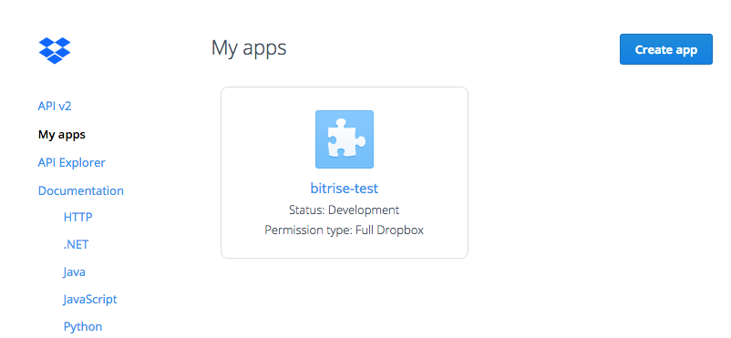

# Bitrise - dropbox step

This step is used to send file to dropbox.

## Important to know

* This step is able to upload only one file
* If a remote file exist with the same name, the file is not deleted
* If you specify a directory, the directory is created

## How to use

You need to create a dropbox account [here](https://www.dropbox.com). After that go on the dropbox developer website [here](https://www.dropbox.com/developers).

Create an dropbox application by clicking on **Create app**

Go in the settings of the application and in the OAuth2 section. Clic on the **Generated access token** to get the dropbox secret (*$DROPBOX_SECRET*).

## Credit

